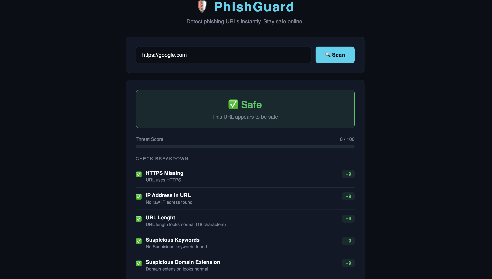
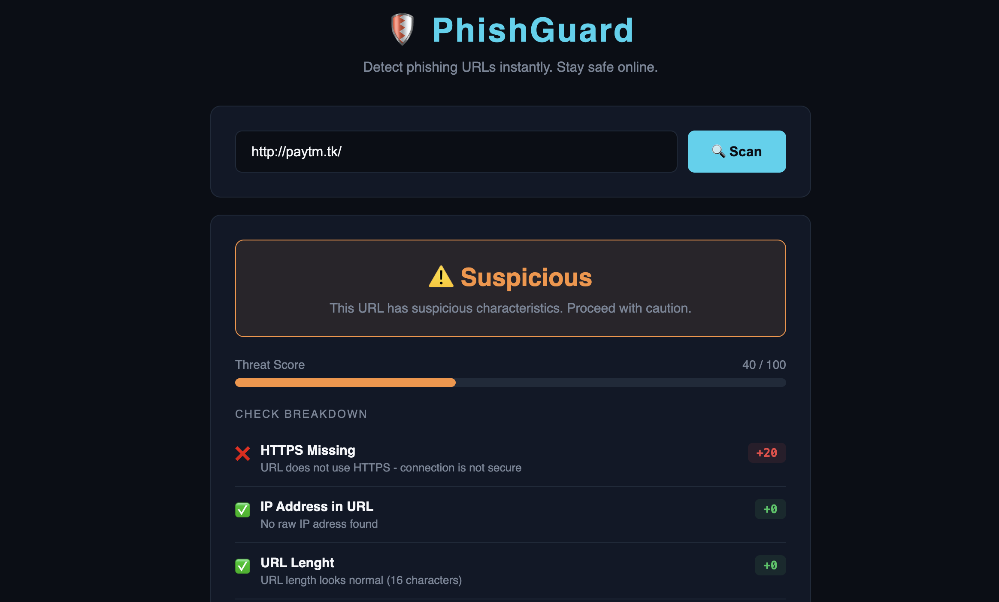
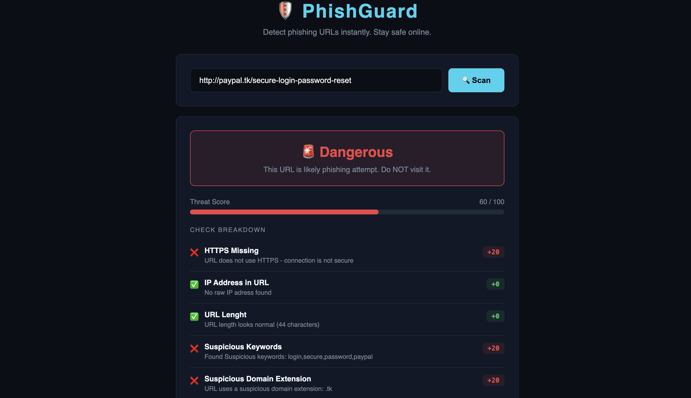

# 🛡️ PhishGuard — Phishing URL Detector


A web-based phishing URL detection tool built with Python and Flask.  
Paste any URL and get an instant threat score with a detailed breakdown.

---
🔗 **Live Demo:** [PhishGuard](https://phishguard-on3a.onrender.com)


## 🎯 What It Does

PhishGuard analyzes a URL across 5 security checks and returns:
- A **Threat Score** out of 100
- A **Verdict** — Safe / Suspicious / Dangerous
- A full **Check Breakdown** explaining every flag

---

## 🔍 Detection Checks (12 Total)

| Check | What It Detects |
|---|---|
| ✅ HTTPS Check | Missing SSL — unencrypted connection |
| ✅ IP Address Check | Raw IP used instead of domain name |
| ✅ URL Length Check | Abnormally long URLs hiding fake domains |
| ✅ Suspicious Keywords | Words like login, verify, bank, paypal, wallet |
| ✅ Domain Extension | Shady extensions like .tk .ml .xyz .buzz .icu |
| 🆕 @ Symbol Redirect | Tricks like google.com@evil.com |
| 🆕 Subdomain Depth | Excessive subdomains impersonating brands |
| 🆕 Hyphen Abuse | Domains with excessive hyphens |
| 🆕 Punycode Detection | International character spoofing (xn--) |
| 🆕 URL Shortener | Hidden destinations via bit.ly, tinyurl, etc. |
| 🆕 Unusual Port | Non-standard ports like :8443 |
| 🆕 Brand Impersonation | Fake domains mimicking Google, PayPal, Apple, etc. |


---

## 🛠️ Tech Stack

- **Backend:** Python 3, Flask
- **Frontend:** HTML5, CSS3, Vanilla JavaScript
- **Deployment:** Render.com

---

## 🚀 Run Locally

```bash
# 1. Clone the repo
git clone https://github.com/angadmaan/phishguard.git
cd phishguard

# 2. Create and activate virtual environment
python3 -m venv venv
source venv/bin/activate

# 3. Install dependencies
pip install -r requirements.txt

# 4. Run the app
python3 app.py
```

Then open `http://127.0.0.1:5000` in your browser.

---

## 📸 Screenshots

> ✅ Safe URL

> 🤨 Suspicious URL

> 🚨 Dangerous URL  


---

## 💡 Real World Use Case

Phishing is the #1 attack vector globally — over 3.4 billion phishing  
emails are sent every day. PhishGuard demonstrates core URL analysis  
techniques used by real security tools like VirusTotal and Google  
Safe Browsing.

---

## 👤 Author

**Angad Singh Maan**  
B.Tech CSE | Cybersecurity | Linux | Networking

[LinkedIn](https://linkedin.com/in/angad-singh-maan) · [GitHub](https://github.com/angadmaan)
